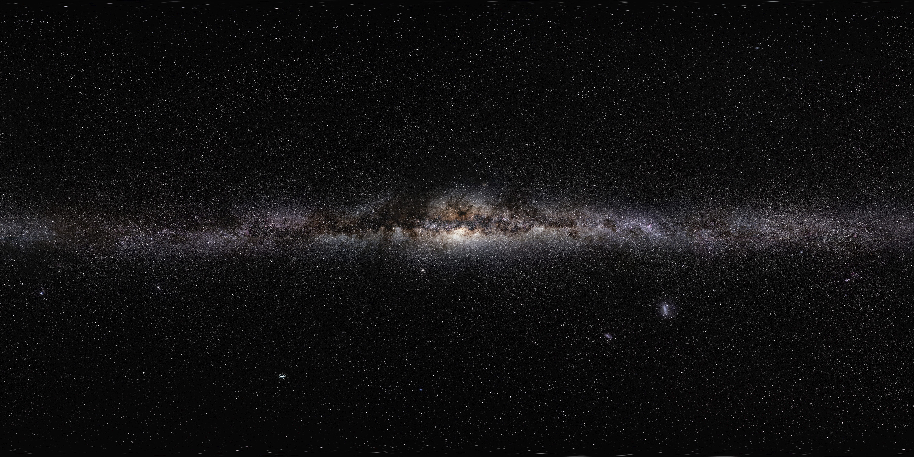

# Space wallpapers

## Corona Australis — current wallpaper

Credit: **ESO**.

- File: `corona-australis.jpg`
- Resolution: 8795 × 8573 pixels, original downloadable JPEG; no resizing or editing.
- Source: [The R Coronae Australis region (eso1027a)](https://www.eso.org/public/images/eso1027a/).
- Download: [ESO large JPEG](https://cdn.eso.org/images/large/eso1027a.jpg).
- License: [Creative Commons Attribution 4.0 International](https://creativecommons.org/licenses/by/4.0/), per [ESO's usage policy](https://www.eso.org/public/outreach/copyright/).

Blue reflection nebulae and warm stars add colour while dark dust clouds keep the background subdued. Hyprpaper's `cover` mode crops the image to each display without stretching it.

## Milky Way panorama

Credit: **ESO/S. Brunier**.

- File: `milky-way-panorama.jpg`
- Resolution: 6000 × 3000 pixels (18 megapixels), original downloadable JPEG; no resizing or editing.
- Source: [The Milky Way panorama (eso0932a)](https://www.eso.org/public/images/eso0932a/).
- Download: [ESO large JPEG](https://cdn.eso.org/images/large/eso0932a.jpg).
- License: [Creative Commons Attribution 4.0 International](https://creativecommons.org/licenses/by/4.0/), per [ESO's usage policy](https://www.eso.org/public/outreach/copyright/).

The dark sky and thin horizontal galactic plane keep the desktop uncluttered. Hyprpaper uses `cover` to fill each monitor without stretching the image.
